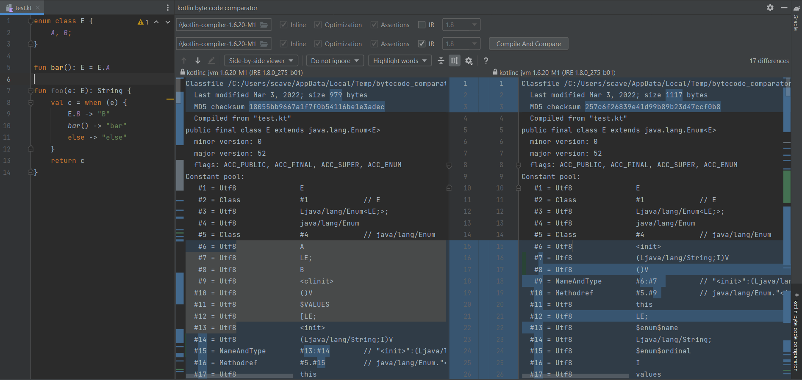

# kotlin bytecode comparator

## What is this  
<!-- Plugin description -->
For my own purposes, a plugin for comparing bytecode between different versions of Kotlin compiler.

It comes with following defects
- Not robust as a toy tool
- Support Windows only, but can be easily extended to support Linux/macOS
- Support `IR`, `Inline` options only
- Slow

## How to use it
1. You can download the built zip from the release page;
2. Or you can build it from the code with:
`./gradlew build`  
The resulting ZIP file is located in build/distributions.

